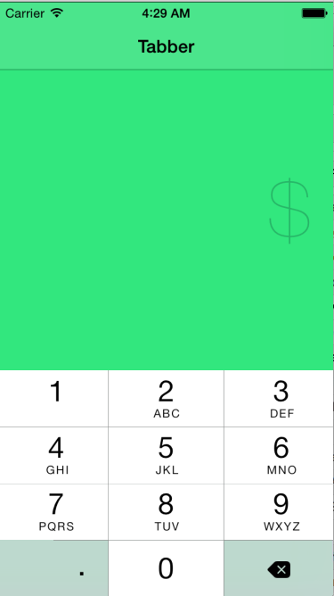
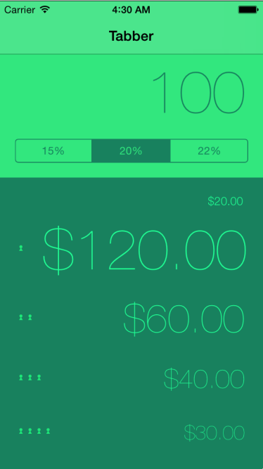

Tabber by Aaron Carambula
======
App by @carambula, README added for MobileBridge teaching/demo guidance.

When teaching even simple examples, we want to inspire students with good design.  This example of a tipcalculator shows variation in design of a simple application.  

Notes
- The design of the initial experience takes into account that we always need the bill amount, so at first, only the text entry field is presented with the keyboard open by default
- After the person starts typing, the rest of the interface appears
- The total amount appears in large text, while the tip is small.  This editorial choice by the app's creator makes the app easier to use, since our eyes will naturally focus on the larger text first.
- Use of color makes the app stand out from other apps. The green in the interface becomes part of the branding, with same color appearing in the icon.  Unlike traditional desktop apps, iOS apps often integrate branding with user interface design.
- When the keyboard is hidden (by tapping anywhere on the screen, which happens naturally when you pick different tip amount), the app reveals splitting bill with two, three or four people.

  

